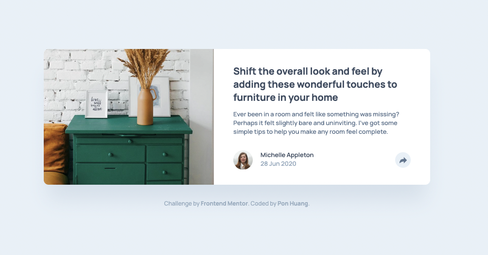
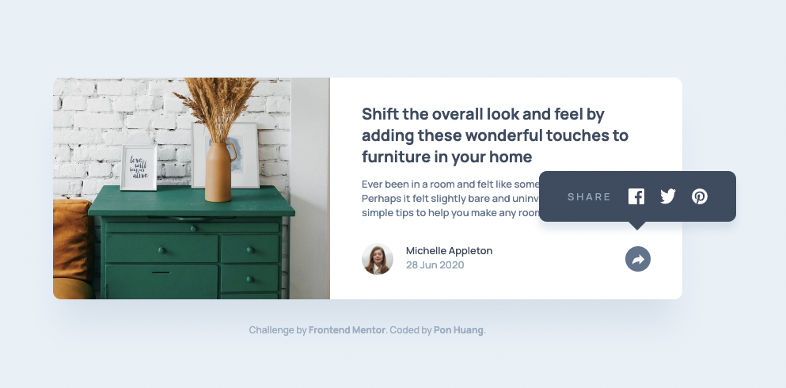
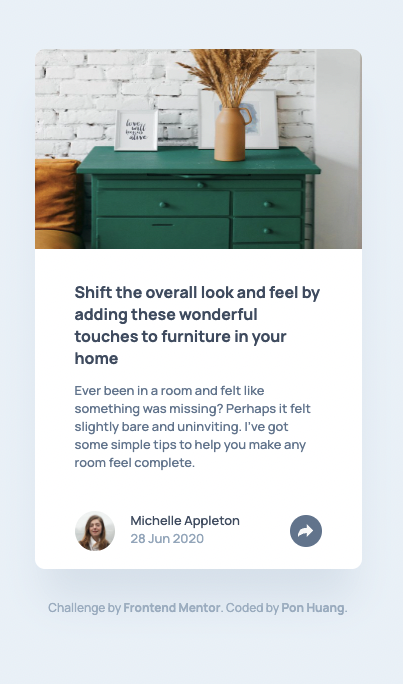
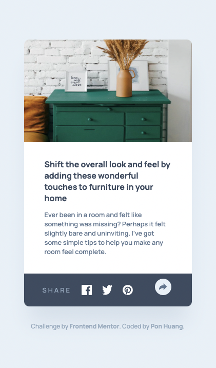

# Frontend Mentor - Article preview component solution

This is a solution to the [Article preview component challenge on Frontend Mentor](https://www.frontendmentor.io/challenges/article-preview-component-dYBN_pYFT). Frontend Mentor challenges help you improve your coding skills by building realistic projects.

## Table of contents

- [Overview](#overview)
  - [The challenge](#the-challenge)
  - [Screenshot](#screenshot)
  - [Links](#links)
- [My process](#my-process)
  - [Built with](#built-with)
  - [What I learned](#what-i-learned)
  - [Continued development](#continued-development)
  - [Useful resources](#useful-resources)
- [Author](#author)
- [Acknowledgments](#acknowledgments)

## Overview

### The challenge

Users should be able to:

- View the optimal layout for the component depending on their device's screen size
- See the social media share links when they click the share icon

### Screenshot

Desktop


Desktop active state


Mobile


Mobile active state


### Links

- Solution URL: [Solution URL here](https://github.com/ponhuang/article-preview)
- Live Site URL: [Live site URL here](https://ponhuang.github.io/article-preview/)

## My process

### Built with

- Semantic HTML5 markup
- NPM node-sass
- SCSS custom properties
- Flexbox
- Desktop-first workflow

### What I learned

Make message box in CSS

```css
.share-container::after {
  content: "";
  position: absolute;
  left: 0;
  right: 0;
  top: 60px;
  width: 0;
  height: 0;
  margin-inline: auto;
  border-top: 15px solid $color-primary;
  border-left: 15px solid transparent;
  border-right: 15px solid transparent;
}
```

### Continued development

Making the share container better.

### Useful resources

- [Message box with CSS arrow](https://codepen.io/ompmega/pen/qByYQd) -

- [CSS Message Box with Arrow Icon](https://codeconvey.com/css-message-box-with-arrow/)

## Author

Pon Huang

[Intagram](https://www.instagram.com/une.tw/)
[Art Blog](https://une722.wordpress.com)

## Acknowledgments
